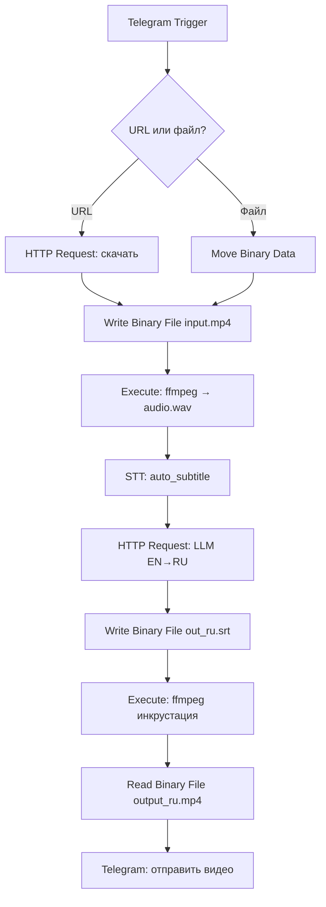

# Задание к лабораторной работе №2

## Цели

1. Освоить оркестровку в **n8n**: триггеры, ветвления, бинарные данные, обработка ошибок.
2. Интегрировать внешние инструменты: **ffmpeg**, открытые STT‑модели (Whisper и аналоги), **LLM** для перевода.
3. Реализовать полный цикл: **Telegram Bot** → загрузка/скачивание видео → извлечение аудио → **распознавание речи** → перевод EN→RU → формирование субтитров → инкрустирование в видео → отправка ответа в бота.

---

## Постановка задачи (пайплайн)

1. **Telegram Bot** принимает **либо ссылку на видео**, либо **сам файл видео**.
2. Если пришла **ссылка** — **скачать видео**; если пришёл **файл** — использовать его напрямую. В обоих случаях **извлечь аудиодорожку** с помощью **ffmpeg**.
3. Сгенерировать **субтитры (EN)**, используя `auto_subtitle`.
4. Выполнить **перевод EN→RU** с помощью **LLM** из HuggingFace (допустим API; предпочтительно — собственный сервер **vLLM/LLama**).
5. **Добавить полученные (RU) субтитры** в исходное видео.
6. **Отправить** результат обратно пользователю в Telegram.

> Допускается работать только с английской речью на входе; многоязычие — как бонус.

---

## Требования к реализации

* **Обработка сбоев:** при сбое возможен повтор шага без «битых» артефактов; временные файлы удаляются; пользователь уведомляется о прогрессе и ошибках.
* **Размеры:** видеозаписи длинной не менее минуты.

---

## Окружение и сервисы

**Обязательно:**

* `n8n` (Docker)
* `ffmpeg` для работы с видео

**Для STT:**

* `auto_subtitle` как бинарь + `Execute Command`, **или**
* `auto_subtitle` в докер контейнер с реализованным API

**Одно из (для перевода):**

* `vLLM`/`llama`/`llama.cpp` сервер с Llama/Qwen/Mistral‑Instruct (локально или удалённо), **или**
* HuggingFace Inference API (допустимо, но желательно локально)

> Для GPU — используйте соответствующие образы/параметры. Для CPU — выбирайте более лёгкие модели (Whisper `small`/`base`).
---

## Ожидаемый результ

* В репозитории: экспорт workflow из n8n, `docker-compose.yml`, `.env.example`, вспомогательные скрипты, `README.md`, `report.pdf`.
* Отчет в формате `.pdf`.

### Требования к отчету

Короткий, но содержательный (до 10`000 символов). 

Требования к оформлению PDF:
Имя файла: report.pdf, шрифт читаемый, 10–12 pt, изображения не «мыльные».

### Pull Request в репозиторий c заданием

Для **сдачи** лабораторной работы:
1. Сделайте fork репозитория с заданием.
2. Залейте код и артефакты (см. список выше). Убедитесь, что репозиторий содержит всё необходимое для сдачи.
3. Откройте PR в исходный репозиторий с заголовком: Lab2: — Фамилия Имя Группа.
4. **Пожалуйста**, используйте `git` для работы с *github*.

### Снижение оценки

Оценка может быть снижена при нарушении следующих правил. Нижеприведённые санкции и примеры — ориентиры; преподаватель оставляет за собой право учитывать контекст.

#### 1) Ручная загрузка файлов в репозиторий
**Что считается нарушением:** загрузка через веб-интерфейс (“Upload files”).

**Как избежать:** используйте `git add/commit/push`, исключайте ненужные файлы и артефакты в `.gitignore`.

#### 2) Спам коммитами
**Что считается нарушением:** серия мелких коммитов без содержательных сообщений и/или осмысленных изменений (например, десятки коммитов подряд вида “fix”, “upd”, правки пробелов).  

**Примеры:**  
- \>10 коммитов за короткий промежуток времени с правками форматирования.  
- Коммиты без описания причины изменений.

**Как избежать:** объединяйте правки (`git add -p`, `git commit --amend`, `git rebase -i`), пишите информативные сообщения коммитов.

#### 3) Плагиат кода или отчёта
**Что считается нарушением:** при подозрении заимствования фрагментов кода/текста без явного указания источника или выдача чужой работы за свою (включая ИИ-генерированный текст без раскрытия факта использования).  

**Штраф:** до 0 баллов за работу; возможна неудовлетворительная оценка по дисциплине. 

**Порядок действий:** при обнаружении плагиата студент вызывается на очную защиту лабораторной работы; по итогам защиты решение по оценке может быть пересмотрено.  
