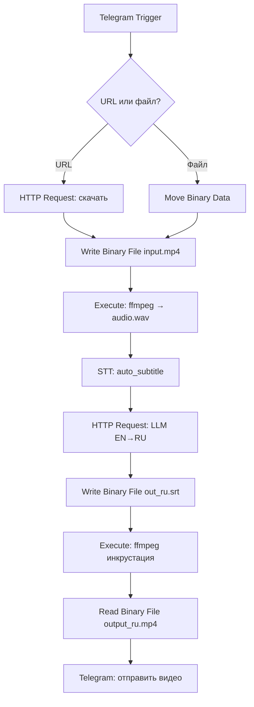

# Заметки по ЛР2

## Пример работы TG бота


## Как запустить проект?

```
cd n8n
docker compose up -d
cd ..
cd auto-subtitle-service
docker compose up -d
```

## О проекте



В качестве STT (Sound To Text) была использована [вот эта утилита](https://github.com/m1guelpf/auto-subtitle).
Она завернута в докер контейнер с реализованным API
