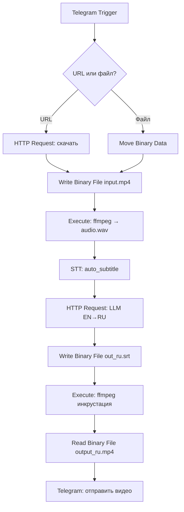

# Задание к лабораторной работе №2

## Постановка задачи (пайплайн)

1. **Telegram Bot** принимает **либо ссылку на видео**, либо **сам файл видео**.
2. Если пришла **ссылка** — **скачать видео**; если пришёл **файл** — использовать его напрямую. В обоих случаях **извлечь аудиодорожку** с помощью **ffmpeg**.
3. Сгенерировать **субтитры (EN)**, используя `auto_subtitle`.
4. Выполнить **перевод EN→RU** с помощью **LLM** из HuggingFace (допустим API; предпочтительно — собственный сервер **vLLM/LLama**).
5. **Добавить полученные (RU) субтитры** в исходное видео.
6. **Отправить** результат обратно пользователю в Telegram.

> Допускается работать только с английской речью на входе; многоязычие — как бонус.

---

## Требования к реализации

* **Обработка сбоев:** при сбое возможен повтор шага без «битых» артефактов; временные файлы удаляются; пользователь уведомляется о прогрессе и ошибках.
* **Размеры:** видеозаписи длинной не менее минуты.

---

## Окружение и сервисы

**Обязательно:**

* `n8n` (Docker)
* `ffmpeg` для работы с видео

**Для STT:**

* `auto_subtitle` как бинарь + `Execute Command`, **или**
* `auto_subtitle` в докер контейнер с реализованным API

**Одно из (для перевода):**

* `vLLM`/`llama`/`llama.cpp` сервер с Llama/Qwen/Mistral‑Instruct (локально или удалённо), **или**
* HuggingFace Inference API (допустимо, но желательно локально)

> Для GPU — используйте соответствующие образы/параметры. Для CPU — выбирайте более лёгкие модели (Whisper `small`/`base`).
---

## Ожидаемый результ

* В репозитории: экспорт workflow из n8n, `docker-compose.yml`, `.env.example`, вспомогательные скрипты, `README.md`, `report.pdf`.
* Отчет в формате `.pdf`.
* Откройте **Pull Request** в учебный репозиторий: название `Lab2: n8n — Фамилия Имя`; приложите команды запуска и скриншоты из n8n/Telegram.